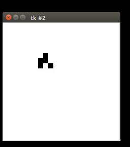
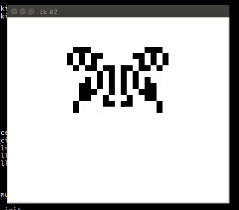

###Conway's Game of Life

The GOL is an environment where cells/squares live and die depending on the numbers of their neighbours.

This is interesting to me for two reasons:

- Given an arrangement of squares in any large number, it would be almost impossible for a human to determine what would happen on the board

- The universe in the simulation is entirely deterministic and the sequence for any pattern will always be the same

The rules for this synthetic universe are pretty simple:

- If a living square has 2 or three neighbours, it will survive

- If a dead square has three neighbours, it will live the next generation

- All other squares will die

I have read that making the simple glider shape is a code interview question, so here it is:



And I've also implemented more complex shapes.



All of these shapes in the ```maps/``` folder were downloaded from this [online repository](http://www.bitstorm.org/gameoflife/lexicon/), where you can download every other known GOL shape in a ```.cells``` file.

###Installation

This project uses Python3.

These installation details will work for an Ubuntu machine, and possibly other OS, but I can't be certain.

Clone this repository to your computer:

    git clone https://github.com/JasonThomasData/game_of_life

Navigate to that game_of_life folder.

Get ```virtualenv``` with these commands:

    sudo apt-get update
    
    sudo apt-get install python-virtualenv

Now, install a virtualenv in the root folder:

    virtualenv -p python3 env

Activate that virtualenv:

    source env/bin/activate

Get pip3 to install dependencies:

    pip3 install -r requirements.txt

By the way, there is only one dependency there, but using requirements.txt is a good habit. Alternatively, do:

    pip3 install numpy

###Usage

This program has two modes:

```animate``` - Loads a window where squares in the simulation will evolve in a window for you to see.

    python3 run_app.py animate maps/glider.cells

```get_cycles``` - Will not provide an animation, but will return an integer of how many cycles were required for the evolution to stop. The intention is to use the latter option for a machine learning project.

    python3 run_app.py get_cycles maps/glider.cells

If you want to change the animation speed or square width, change the properties of the Animation class in the application folder.

The board where the squares evolve, in ```animation``` and ```get_cycles``` mode, will have a buffer around it. The Board class has the property to change that buffer. The buffer is a good idea because the shapes from the online repository of shapes are in files only large enough for the shapes, but some shapes will take over a board four times as large.

###Tests

To run the tests, stay in the project's root folder and run:

    python3 -m unittest discover test/

###Discussion

This project uses Numpy, since that's a good way to handle very large MD lists. Itertools is used for looping, where possible/makes sense. Tkinter is used for the animation.

The use of Tkinter required the Animation class to handle the game loop, since Tkinter has a built in method for animation loops, so that's the sensible way to do that. If this is run in ```get_cycles```, however, just has a loop inside the Game class.

There are two things about this project I would like to change if I get time:

- At the terminal, I would add an option to generate cells/squares randomly on the board, as that would be interesting to have random data. This would also be better for the machine learning aspect.

- Create another program that collects the results, via a pipe, and saves those to a database to do some machine learning.

This machine learning could be interesting for a) the most interesting results b) sustainable shapes c) the longest running simulation. To do that, I think a neural network would do the trick.

I made this project with Python3, Ubuntu 16.04 and Vim.

###Licence

This project is in the Public Domain, and is free from copyright.

###Contributing

I did this project because:

- I knew it would be a fun program to make

- Making a glider is a code test interviewers ask

I suggest making your own GOL could be a lot of fun, but of course if you'd prefer to contribute then make a pull request.
